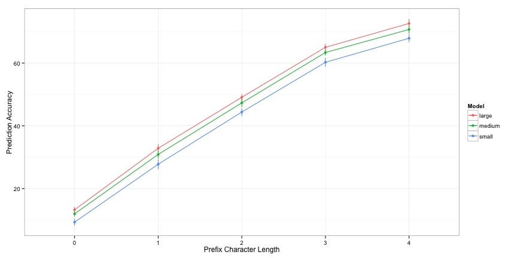
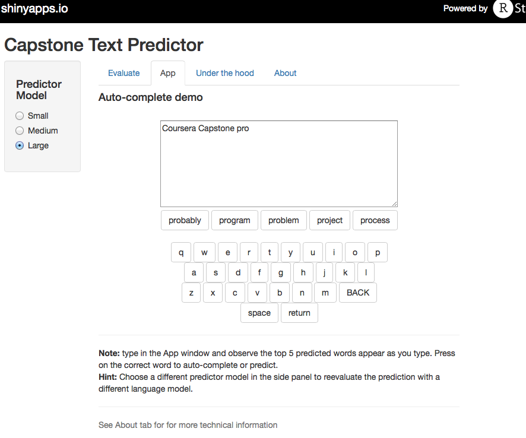

Coursera Data Science Capstone
========================================================
author: Guido Gallopyn
date: 4-26-2015
width: 1422
height: 800

Text Prediction

Overview
========================================================

- This project was done entirely in R using tm, RWeka, hash, dplyr and ggplot2 packages. (excellent LM tool-kits are available from [CMU](http://www.speech.cs.cmu.edu/SLM_info.html), [SRI](http://www.speech.sri.com/projects/srilm/), but I preferred to dig into R text processing and NLP)

- An S3 object was developed for NGram language models with arbitrary N. 
   + [Katz back-off model training](http://en.wikipedia.org/wiki/Katz's_back-off_model), 
   + Prediction with BestScore and NBestScore calculations. 
   + Performance evaluation, including Coverage, Perplexity and prediction Accuracy
   + [ARPA LM format](http://www.speech.sri.com/projects/srilm/manpages/ngram-format.5.html) import/export 
   + makes extensive use of [hash package](http://cran.r-project.org/web/packages/hash/hash.pdf) to efficiently store and access n-gram counts, probabilities, back-off weights, following word lists and a word [trie data structure](http://en.wikipedia.org/wiki/Trie). 

- with a 3 character prefix, an auto-complete feature based on this moel can predict the right next word 2 out of 3 times.

- a [shiny App demo](https://senseiguido.shinyapps.io/TextPrediction/) was build to showcase the Text Predictor.  

Algorithm
========================================================

Text prediction is the task of selecting the word $w_{i}$ with maximum probability $p$ using left context $w_{i-n+1}... w_{i-1}$ and a noisy channel observation $o$ of the word $w_{i}$n as predictors.

Via Bayes Rule we get: 

$$\hat{w} = \underset{w_{i} \in Words} {argmax}~(~(p( o \mid w_{i} ) \cdot p( w_{i} \mid w_{i-n+1}... w_{i-1} )~)$$

Let $o$ be a $prefix$ of $w_{i}$, then 

$$\hat{w} = \underset{w_{i} \in \{w~:~isPrefix(prefix,w) , w \in Words\ \} } {argmax} ~p( w_{i} \mid w_{i-n+1}... w_{i-1} )$$

$p( w_{i} \mid w_{i-n+1}... w_{i-1})$ : [n-gram language model](https://web.stanford.edu/class/cs124/lec/languagemodeling.pdf)

Note: observations other than word prefixes are commonly in use, including keyboard swipe, pen-strokes in hand writing recognition, word images in OCR, and voice in speech recognition.  

Language Model Training
========================================================

- As mentioned in the [Milestone Report](https://rpubs.com/SenseiGuido/66682), the Capstone data was cleaned and tokenized with tm and RWeka

- The full text corpus (~100M words) was split in training (90%) and evaluation (10%), then the training corpus was sub-sampled in 10, 3 and 1 million word corpora, final models were trained on the 10 million word training corpus.   

- Model building and evaluation experiments were run to measure Coverage, Perplexity, Prediction Accuracy, LM-Size and prediction speed in function of word-frequency threshold K, Ngram-order N and training corpus size.

- Finally a "small"", "medium" and "large"" language model were selected for use with the shiny app

<!-- html table generated in R 3.2.0 by xtable 1.7-4 package -->
<!-- Mon Apr 27 12:39:15 2015 -->
<table border=1>
<tr> <th>  </th> <th> Model </th> <th> N </th> <th> K </th> <th> uniGrams </th> <th> biGrams </th> <th> triGrams </th> <th> Size.Mb </th>  </tr>
  <tr> <td align="right"> 1 </td> <td> small </td> <td align="right">   2 </td> <td align="right">  40 </td> <td align="right"> 11784 </td> <td align="right"> 19985 </td> <td align="right">   0 </td> <td align="right"> 0.95 </td> </tr>
  <tr> <td align="right"> 2 </td> <td> medium </td> <td align="right">   3 </td> <td align="right">  20 </td> <td align="right"> 17896 </td> <td align="right"> 40661 </td> <td align="right"> 16757 </td> <td align="right"> 2.30 </td> </tr>
  <tr> <td align="right"> 3 </td> <td> large </td> <td align="right">   3 </td> <td align="right">   7 </td> <td align="right"> 32285 </td> <td align="right"> 110943 </td> <td align="right"> 65020 </td> <td align="right"> 5.90 </td> </tr>
   </table>

Performance Evaluation
===

 

<!-- html table generated in R 3.2.0 by xtable 1.7-4 package -->
<!-- Mon Apr 27 12:39:16 2015 -->
<table border=1>
<tr> <th>  </th> <th> Model </th> <th> N </th> <th> 0 </th> <th> 1 </th> <th> 2 </th> <th> 3 </th> <th> 4 </th>  </tr>
  <tr> <td align="right"> 1 </td> <td> small </td> <td align="right">   2 </td> <td align="right"> 9.30 </td> <td align="right"> 27.80 </td> <td align="right"> 44.40 </td> <td align="right"> 60.30 </td> <td align="right"> 67.90 </td> </tr>
  <tr> <td align="right"> 2 </td> <td> medium </td> <td align="right">   3 </td> <td align="right"> 11.90 </td> <td align="right"> 30.90 </td> <td align="right"> 47.30 </td> <td align="right"> 63.40 </td> <td align="right"> 70.70 </td> </tr>
  <tr> <td align="right"> 3 </td> <td> large </td> <td align="right">   3 </td> <td align="right"> 13.20 </td> <td align="right"> 32.80 </td> <td align="right"> 49.10 </td> <td align="right"> 65.00 </td> <td align="right"> 72.60 </td> </tr>
   </table>

Note: prefix length zero means model only uses previous N-1 words
***
<small>
- Accuracy was measured on a 1% sub-sample of the evaluation corpus (~ 100k words) for word-prefix lengths from 0 to 4 

- 10 bootstrap iterations were run to estimate a mean and a standard error of the prediction accuracy.  

- Observations and Conclusions
   + The best models for all prefix lengths is the large tri-gram model.
   + using only trigram word history, the best model is only ~13% accuracy, best model has ~4% absolute increase in accuracy over the small model
   + observation of a letter increases accuracy with ~15%, upto 3 letters, then accuracy increase slows down
   
</small>

Show-Case Application
========================================================

 
 
 
 ***
 <small>
 a [shiny App demo](https://senseiguido.shinyapps.io/TextPrediction/) was build to show-case the Text Predictor. 
 
- it takes as input a phrase (multiple words) in a text box input and outputs a prediction of the top-5 next best words (best on top)

- it provides an auto-complete demonstration (see screenshot) that simulates a mobile keyboard App, rthat provides top 5 predicted words as users type. This allows for an evaluation of typing performance inprovement and gives a good sense of the prediction speed.

- it provides a glimpse under the hood, with summary statistics of the underlying language models.
 
</small> 
 

 
